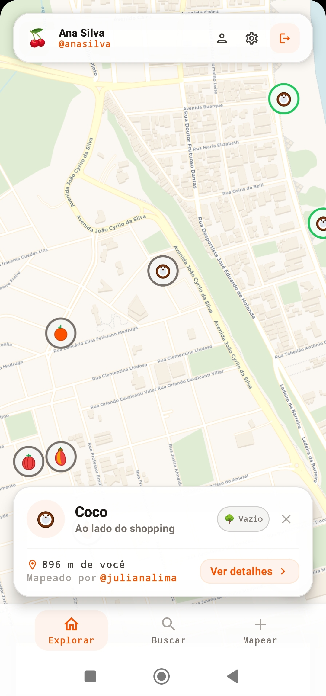

<div align="center">

# 🥭 Mamão com Açúcar

**A community-driven urban mapping mobile application designed with a focus on UI/UX engineering, real-time synchronization, and local food sustainability.**

[](https://play.google.com/store/apps/details?id=com.felipelaurindo.mamaocomacucar)
[](https://kotlinlang.org/)
[](https://developer.android.com/jetpack/compose)
[](https://firebase.google.com/)
[](https://github.com/osmdroid/osmdroid)

<br /><br />

<a href="https://play.google.com/store/apps/details?id=com.felipelaurindo.mamaocomacucar" target="_blank">
  
</a>

</div>

---

## Product Vision & Community Impact

In many Brazilian cities, public parks and streets are filled with fruit-bearing trees—mangoes, papayas, pitangas, avocados, and jambos—whose harvests frequently go ungathered or wasted due to a lack of visibility.

**Mamão com Açúcar** was created to bridge this gap. The platform empowers citizens to discover, map, and monitor urban fruit trees in real time, turning passive city spaces into active, shared community food sources.

### From Prototype to Native Execution
This project demonstrates end-to-end product ownership and architectural evolution:
- **Concept Validation**: Initially prototyped as a React/Vite web application to test interaction flows and validate user demand.
- **Native Re-Engineering**: Rebuilt as a native Android application in **Kotlin** and **Jetpack Compose** to achieve 60fps vector map performance, offline tile caching, precise GPS integration, and smooth edge-to-edge UI transitions.

---

## UI/UX Engineering & Design Decisions

As a frontend and mobile engineer, every visual and structural choice was guided by human-centered design principles for real-world outdoor usage:

1. **Low Cognitive Load & High Contrast (Outdoor Readability)**:
   - Designed for users on the move under direct sunlight. Map tiles support high-contrast, clean and watermark-free themes: **Relevo** (*Esri World Topo Map*) and **Satélite** (*Esri World Imagery*).
   - Biological fruiting stages use distinct color-coded indicators and universal symbols (🌸 Blooming, 🍏 Growing, 🍎 Ripe, 🍂 Dry) so users can assess tree status instantly.

2. **Mobile-First & Edge-to-Edge Hierarchy**:
   - Built with strict Material Design 3 guidelines using floating cards, custom elevation, and zero-clutter overlays.
   - System bar insets (`statusBarsPadding`, `navigationBarsPadding`) ensure full edge-to-edge canvas execution without blocking interactive map controls or floating action buttons.

3. **Custom Design System & Tokens**:
   - Interface colors follow a strict design system based on `MamaoOrange` (`#F97316`) for primary actions, `MamaoGreen` (`#16A34A`) for nature accents, and a warm neutral `Stone` palette (`Stone50` to `Stone950`) to eliminate stark, unrefined blacks and grays.

4. **Frictionless Proximity Discovery**:
   - Eliminates complex manual filtering. Nearby trees are automatically calculated and sorted using geodesic distance formulas (Haversine algorithm) in real time relative to the user's live coordinates.

5. **Gamification for User Retention**:
   - Progressive contributor badges (*Sementinha* to *Mestre Frutífero*) reward continuous user engagement and encourage community-driven data collection.

---

## Technical Architecture & State Management

The application adheres to clean Android architecture using **MVVM (Model-View-ViewModel)** with unidirectional state flows.

```
┌─────────────────────────────────────────────────────────┐
│                    Jetpack Compose                      │
│            (Material 3 & Custom Design System)          │
└───────────────────────────┬─────────────────────────────┘
                            │ StateFlow / UI States
┌───────────────────────────▼─────────────────────────────┐
│                      MapViewModel                       │
│             (Business Logic & Proximity Calculations)   │
└───────────────────────────┬─────────────────────────────┘
                            │ Data Flow
┌───────────────────────────▼─────────────────────────────┐
│                 Firebase / OSMDroid Service             │
│        (Firestore Realtime Sync & Disk Tile Cache)      │
└─────────────────────────────────────────────────────────┘
```

### Key Technical Specs

- **Language & Framework**: Kotlin 2.0+, Jetpack Compose, Material Design 3
- **Map Vector Engine**: OSMDroid (`org.osmdroid:osmdroid-android:6.1.20`) with disk tile caching (`Configuration.getInstance().load()`) for instant map loads
- **Real-Time Data Layer**: Firebase Cloud Firestore for live community status updates and comment streaming
- **Auth & Security**: Firebase Auth session persistence
- **Geospatial Processing**: Real-time Haversine distance sorting and smooth camera interpolation (`animateTo`)
- **Target SDK**: API 36 (Min SDK 24)

---

## System Features

### Client & Map Experience
- Real-time interactive map with custom pins reflecting tree species and biological status.
- Single-tap GPS recentering with fluid camera interpolation.
- Live tile style selector sheet (Relevo / Topo, Satélite).

### Tree Registration & Community Logs
- Quick-add modal for pinpointing new fruit trees with custom metadata.
- Interactive detail sheet (`TreeDetailSheet`) featuring historical community logs and update forms.
- Dynamic search and status filter sheet (`TreeListSheet`) with live distance display.

### Native Botanical Guide (Guia Botânico)
- Built-in catalog of **68 fruit tree species** featuring custom vector icons, biological fruiting timelines, and species-specific harvest tips.
- Instant search and offline filtering for rapid outdoor tree identification.

### Modern Auth & Non-Intrusive Monetization
- **Google Credential Manager**: Seamless, secure one-tap authentication via modern Android Identity APIs (`androidx.credentials`).
- **AdMob Banner Architecture**: Floating banner placement responsive to Android window insets, keeping map interaction and GPS buttons completely unobstructed.

---

## Repository Structure

```text
app/src/main/java/com/felipelaurindo/mamaocomacucar/
├── MainActivity.kt                # Main activity initializing edge-to-edge layout & OSMDroid cache
├── MamaoApp.kt                    # NavHost configuration & auth state management
├── data/
│   └── model/
│       ├── LoggedUser.kt          # Authenticated user model
│       ├── Tree.kt                # Tree entry model (coordinates, species, status)
│       ├── TreeStatus.kt          # Status enum & visual metadata
│       ├── TreeUpdate.kt          # Community status update & comment log
│       └── UserBadge.kt           # User badge ranks & contribution logic
├── ui/
│   ├── auth/
│   │   ├── AuthViewModel.kt       # Auth state management (Email, Google Sign-In, Password Reset)
│   │   ├── LoginScreen.kt         # Firebase authentication screen
│   │   ├── RegisterScreen.kt      # User registration screen
│   │   └── components/
│   │       ├── ForgotPasswordDialog.kt # Password reset dialog with validation
│   │       └── GoogleSignInButton.kt   # Credential Manager Google Sign-In button
│   ├── map/
│   │   ├── MapScreen.kt           # Main map screen with OSMDroid overlays & FAB controls
│   │   ├── MapViewModel.kt        # Map state management & location handling
│   │   └── components/
│   │       ├── AddTreeDialog.kt   # Dialog to register a tree at selected coordinates
│   │       ├── TreeDetailSheet.kt # BottomSheet showing tree details & update history
│   │       ├── TreeListSheet.kt   # Search, filter, and proximity-sorted list sheet
│   │       └── ToastOverlay.kt    # Native animated notification overlay
│   ├── settings/
│   │   ├── AccountSettingsSheet.kt # User profile, stats & badge display
│   │   └── AppSettingsSheet.kt    # Map tile style selection sheet (Relevo, Satélite)
│   └── theme/
│       ├── Color.kt               # Color tokens (MamaoOrange, MamaoGreen, Stone palette)
│       ├── Theme.kt               # Material Design 3 theme wrapper
│       └── Type.kt                # Typography configuration
└── util/
    └── LocationUtils.kt           # Geodesic distance calculation (Haversine) & formatters
```

---

## Local Setup

### Prerequisites
- **Android Studio** (Jellyfish / Koala or newer).
- **JDK 17** configured in your environment.
- **Android Device or Emulator** running Android 7.0+ (API 24+) with location services enabled.

### Build Instructions

1. **Clone the repository**:
   ```bash
   git clone https://github.com/felipematheuslo/mamao-com-acucar-android.git
   cd mamao-com-acucar-android
   ```

2. **Configure Firebase**:
   - Download `google-services.json` from your Firebase console.
   - Place it inside the `app/` folder:
     ```text
     mamao-com-acucar-android/
     └── app/
         └── google-services.json
     ```

3. **Build & Run**:
   - Open the project in Android Studio, allow Gradle sync to complete, and run (`Shift + F10`).

---

## License

This project is open-source and intended for community use. Contributions and feedback are welcome.
